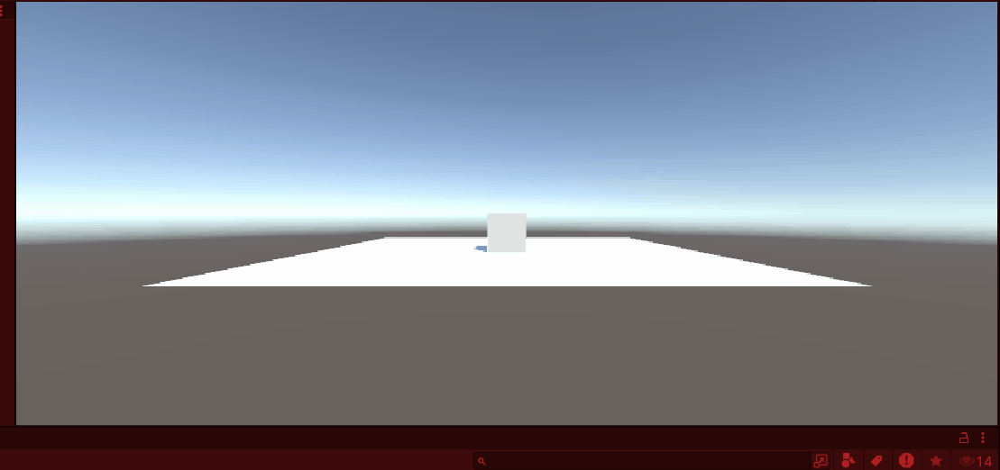
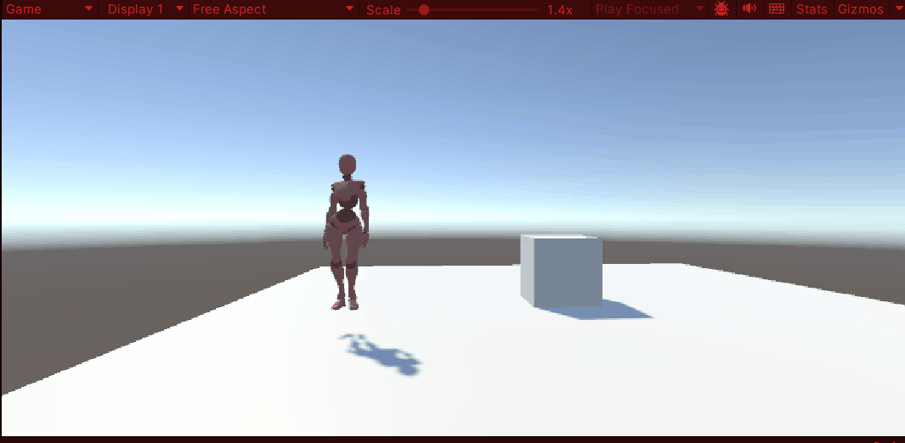

# Tutorial 0. 
met deze tutorial heb ik een blokje omhoog laten gaan. 
als je op spatie drukt vliegt het blokje omhoog

[scriptTutorial0](assets/Scripts/LaunchCube.cs)

# Tutorial 1.

met deze tutorial heb ik een character een achteruit salto laten doen als je op P drukt doet die een salto

[scriptTutoral1](assets/Scripts/Flip.cs)