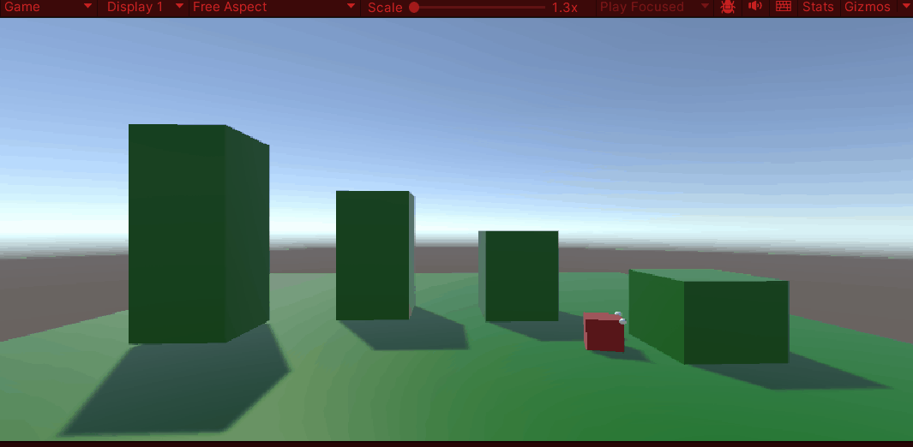
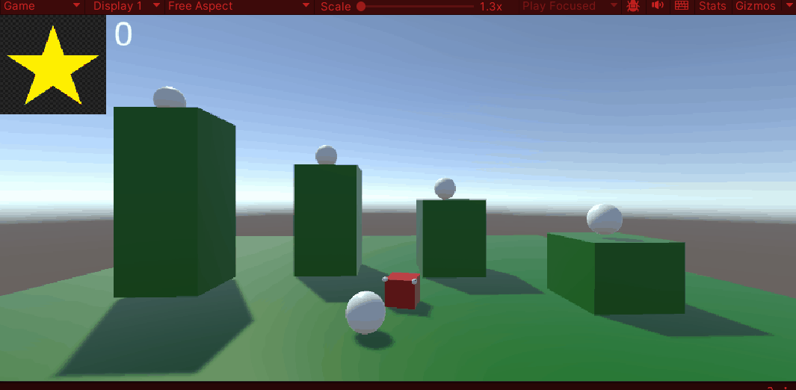
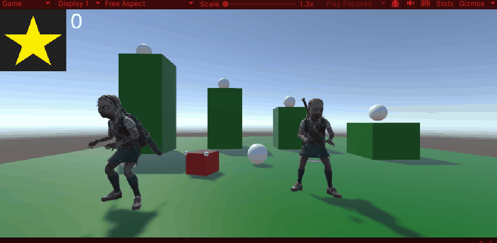

# Tutorial 0. 
met deze tutorial heb ik een blokje omhoog laten gaan. 
als je op spatie drukt vliegt het blokje omhoog

[scriptTutorial0](Assets/Scripts/LaunchCube.cs)

# Tutorial 1.

met deze tutorial heb ik een character een achteruit salto laten doen als je op P drukt doet die een salto

[scriptTutoral1](Assets/Scripts/Flip.cs)

# Tutorial 2.

met deze tutorial heb ik het character laten lopen en draaien als je wsda keys gebruikt kun je hem vooruit en achteruit laten lopen en laten draaien allebij de kanten op.

[scriptTutorial2](Assets/Scripts/MoveBasic.cs)

# Tutorial 3.

met deze tutorial heb ik de speler laten springen op platvormen.

[ScriptTutorial3](Assets/Scripts/Jump.cs)
[ScriptTutorial3Movement](Assets/Scripts/MoveBasic.cs)

# Tutorial 4

met deze tutorial heb ik pickups gemaakt. als je tegen een pickup aan komt dan verdwijnt die en krijg je 5 punten

[scriptPickup](Assets/Scripts/GetPickup.cs)
[scriptScore](Assets/Scripts/KeepScore.cs)

# Tutorial 5 

met deze tutorial heb ik enemies gemaakt en een bullet waarmee ik ze kan shieten

[ScriptKillOnHit](Assets/Scripts/KillOnHit.cs)
[ScriptMoveBullet](Assets/Scripts/BulletMove.cs)
[ScriptShoot](Assets/Scripts/Shoot.cs)